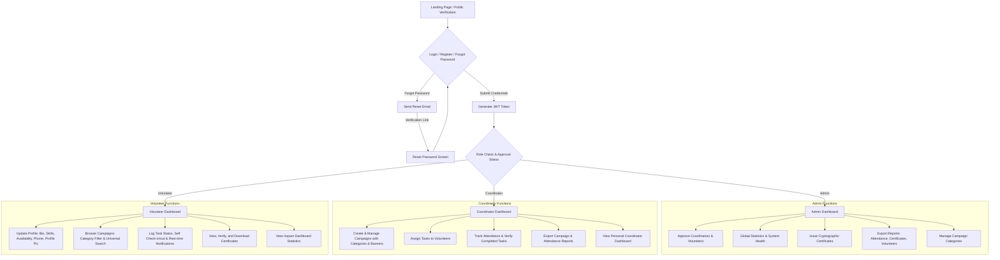
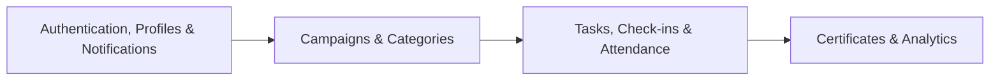

# NGO Volunteer Management System - Project Architecture & Detailed Implementation Plan

## 📁 Project Overview
The NGO Volunteer Management System is a streamlined web application designed to manage the lifecycle of charity campaigns and volunteer activities. The platform enables coordinators and admins to create campaigns, assign tasks, log volunteer attendance, verify credentials, and issue cryptographic certificates.

This plan integrates several key enhancements categorized by implementation priority to elevate user experience, platform utility, and data management.

---

## 🛠️ Technology Stack
* **Backend**: Node.js + Express.js + MongoDB (Mongoose) + Multer (for file uploads)
* **Frontend**: React.js (Vite) + Vanilla CSS (Aesthetic layout with glassmorphism, responsive menus, and charts)
* **Session Management**: JWT (JSON Web Tokens) with Role-Based Access Control (RBAC)
* **Mail Dispatcher**: Nodemailer (for password reset lifecycles and key alerts)

---

## 🗺️ User Flow Diagram
Below is the standard user journey and roles integration, updated to include the password reset flow, dashboard stats, notification hub, search/filter feeds, and report downloads:



---

## 🔗 Module Dependency
The architecture is structured around four primary collections containing nested components (such as notifications and password tokens) to maintain a clean database layout:



---

## 🔐 Authorization Matrix
This matrix defines access permissions across the system, enforced via role-based middleware, expanded for the new dashboard, search, reports, and profile options:

| Action | Guest | Volunteer | Coordinator | Admin | Priority |
| :--- | :---: | :---: | :---: | :---: | :---: |
| Register Account | ✅ | ✅ | ✅ | ✅ | Core |
| Login / Authenticate | ✅ | ✅ | ✅ | ✅ | Core |
| Forgot / Reset Password | ✅ | ✅ | ✅ | ✅ | Optional |
| View Own Dashboard Statistics | ❌ | ✅ | ✅ | ✅ | High |
| View Global / System Statistics | ❌ | ❌ | ❌ | ✅ | High |
| Search & Filter Campaigns / Tasks | ✅ | ✅ | ✅ | ✅ | High |
| Search & Filter Volunteers / Members | ❌ | ❌ | ✅ | ✅ | High |
| Export Reports (Campaign/Attendance) | ❌ | ❌ | ✅ | ✅ | High |
| Export Reports (System/Certificates) | ❌ | ❌ | ❌ | ✅ | High |
| Update Profile (Phone, Bio, Skills) | ❌ | ✅ | ✅ | ✅ | Medium |
| Upload Profile Avatar / Picture | ❌ | ✅ | ✅ | ✅ | Optional |
| View & Read Notifications | ❌ | ✅ | ✅ | ✅ | Medium |
| Create / Edit / Delete Campaigns | ❌ | ❌ | ✅ | ✅ | Core |
| Upload Campaign Banners | ❌ | ❌ | ✅ | ✅ | Optional |
| Create & Assign Tasks | ❌ | ❌ | ✅ | ✅ | Core |
| Update Task Work Status | ❌ | ✅ | ✅ | ✅ | Core |
| Self Check-In / Check-Out (Attendance) | ❌ | ✅ | ❌ | ❌ | Core |
| Verify Attendance / Approve Tasks | ❌ | ❌ | ✅ | ✅ | Core |
| Approve / Reject Users | ❌ | ❌ | ❌ | ✅ | Core |
| Manage Campaign Categories | ❌ | ❌ | ❌ | ✅ | Optional |
| Generate & Issue Certificates | ❌ | ❌ | ❌ | ✅ | Core |
| Verify Certificate Publicly | ✅ | ✅ | ✅ | ✅ | Core |

---

## 📋 Functional Requirements (with Feature Extensions)

### 📊 1. Dashboard Statistics (High Priority)
* **Volunteer Dashboard**:
  * **Personal Impact Metrics**: Total hours logged, number of completed tasks, number of joined campaigns, and certificates earned.
  * **Visual Component**: A progress bar showing hours logged towards target milestones.
* **Coordinator Dashboard**:
  * **Campaign Metrics**: Active campaigns, total registered volunteers under their campaigns, pending task approvals, and average volunteer completion rate.
  * **Visual Component**: Chart/diagram of task distribution (Pending vs. In-Progress vs. Completed).
* **Admin Dashboard**:
  * **Global Analytics**: Total volunteers, total coordinators, pending user approvals, total hours logged across all campaigns, and total certificates issued.
  * **Visual Component**: Dynamic numerical widgets with quick links to pending tasks and approvals.

### 🔍 2. Search & Filter Engine (High Priority)
* **Campaign Explorer**:
  * **Universal Search**: Search campaigns by text matching the title, description, or location.
  * **Category Filter**: Filter campaigns by specific categories (e.g. Education, Health, Environment).
  * **Status Filter**: Filter by `active` or `completed`.
* **Tasks Manager**:
  * **Filter Matrix**: Filter tasks by status (`pending`, `in-progress`, `completed`), due date, or assigned volunteer name.
* **Volunteer Registry (Admin/Coordinator Only)**:
  * **Member Search**: Find volunteers by name, email, skills, or availability status.

### 📈 3. Reporting & Analytics (High Priority)
* **Volunteer Report**: Export list of active volunteers, their skills, total hours volunteered, and campaigns joined (supports CSV/PDF format).
* **Campaign Report**: Performance review for specific campaigns, including volunteer turn-out, total tasks completed, and success status.
* **Attendance Logs**: Export detailed spreadsheets of check-in and check-out logs, including coordinates/locations if tracked, verified hours, and audit status.
* **Certificates Registry**: Log of all cryptographically signed certificates issued by the system, tracking volunteer ID, issue date, and certificate hash.

### 👤 4. Extended User Profiles (Medium Priority)
* **Core Profile Extensions**: Add a mandatory/optional phone number field during profile updates.
* **Avatar Upload**: Support for profile picture upload using secure local storage (Multer helper mapping to `/uploads/avatars`).
* **Visual Profile Card**: Modern header showing profile image, role badge, contact details, bio, and dynamic skills tags.

### 🔔 5. Notifications Hub (Medium Priority)
* **Real-Time / In-App Alerts**:
  * **Trigger Events**:
    * When a coordinator assigns a new task to a volunteer.
    * When an admin approves or rejects a pending coordinator/volunteer account.
    * When an admin issues a cryptographic completion certificate.
    * When a coordinator approves/rejects hours for check-in attendance.
  * **User Options**: Panel listing unread notifications with a one-click "Mark as Read" action and a badge displaying the unread count in the navigation header.

### 🏷️ 6. Campaign Categories (Optional)
* **Categorization**: Group campaigns into designated tracks: `Education`, `Health`, `Environment`, `Disaster Relief`, `Community Service`, and `Other`.
* **Management**: Admins can configure or expand category structures if needed, and coordinators assign a single category during campaign creation.

### 🔑 7. Password Recovery Lifecycle (Optional)
* **Forgot Password Link**: Located on the login screen. Allows users to enter their registered email.
* **Security Token**: Generates a secure, short-lived cryptographic reset token stored in the database with an expiration timestamp.
* **Email Notification**: Sends an email via Nodemailer containing the link `http://localhost:5173/reset-password/:token`.
* **Reset Screen**: Verifies the token is valid/unexpired and lets the user update their password securely.

### 🖼️ 8. Campaign Banner Upload (Optional)
* **Visual Appeal**: Enhances campaign detail pages and exploration grids with a custom campaign banner.
* **Upload Path**: Utilizes Multer backend mapping to `/uploads/campaigns` with automatic image aspect ratio validation on the client.

---

## 📁 Directory Structure & Frontend Architecture

The application structure is organized into a clean client-server architecture. Below is the detailed breakdown:

```text
NGO_Volunteer_System/
├── Backend/
│   ├── src/
│   │   ├── config/             # Database connection & file storage config
│   │   │   ├── db.js
│   │   │   └── storage.js      # Multer configuration for uploads
│   │   ├── middleware/         # Global auth & role authorization middlewares
│   │   ├── utils/              # Helper utilities (Email dispatcher, hash generator)
│   │   ├── models/             # Mongoose schemas (4 Core collections)
│   │   │   ├── User.js
│   │   │   ├── Campaign.js
│   │   │   ├── Task.js
│   │   │   └── Certificate.js
│   │   ├── modules/            # Domain-specific route handler and controller modules
│   │   │   ├── auth/
│   │   │   ├── campaigns/
│   │   │   ├── tasks/
│   │   │   └── certificates/
│   │   └── app.js              # Express app setup & middleware registrations
│   ├── uploads/                # Local uploads storage directory
│   ├── .env.example
│   └── package.json
└── Frontend/
    ├── src/
    │   ├── assets/             # Static files (images, icons, theme-specific SVGs)
    │   ├── components/         # Reusable UI component blocks (Buttons, Cards, Inputs, Modals)
    │   ├── layouts/            # Persistent outer shell layout layouts (Admin/Coordinator/Volunteer wrapper templates)
    │   ├── pages/              # Role-specific and authentication screens
    │   │   ├── authentication/ # Authorization screens (Login, Register, ForgotPassword, ResetPassword)
    │   │   ├── volunteer/      # Volunteer-facing screens (Impact Dashboard, Profile, Tasks)
    │   │   ├── coordinator/    # Coordinator-facing dashboards and management tools
    │   │   └── admin/          # Admin portal pages (Approvals, Certificate management)
    │   ├── App.jsx             # Top-level React routing and global state context aggregation
    │   └── main.jsx            # Frontend entrypoint
    └── package.json
```

### 🎨 Detailed Frontend Structure & Use-Cases

1. **`Frontend/src/assets/`**: Stores static resource files (e.g. logos, placeholder avatars, theme templates) that do not change dynamically.
2. **`Frontend/src/components/`**: Standard, stateless UI pieces designed to be modular and reusable.
   * `Navbar.jsx`: Global header displaying branding, user profile quick menu, and notification badge.
   * `Sidebar.jsx`: Navigational panel with role-specific menu routes.
   * `Card.jsx`: Container block utilized for campaign listing, stats preview, or task item detail mapping.
   * `Button.jsx`: Styled button wrapper ensuring design uniformity across forms.
   * `Modal.jsx`: Custom container displaying modals for confirmation, task check-ins, or reports.
3. **`Frontend/src/layouts/`**: Wrappers for different route categories. If a route changes inside the layout, only the inner `<Outlet />` is re-rendered while the sidebars, headers, and footers stay static.
   * `AdminLayout.jsx`: Houses admin-specific sidebar options and global system statistics shortcuts.
   * `CoordinatorLayout.jsx`: Handles coordinator management panels.
   * `VolunteerLayout.jsx` / `UserLayout.jsx`: Adapts page menus to profile impact tracking.
4. **`Frontend/src/pages/`**: Viewport page instances rendering specific content.
   * **`authentication/`**: Dedicated files handling user authorization flows (`Login.jsx`, `Register.jsx`, etc.).
   * **`volunteer/`**: Houses user profile details (`Profile.jsx`), task status check-ins (`TaskLogs.jsx`), and search feeds (`CampaignExplorer.jsx`).
   * **`coordinator/`**: Contains interfaces for assignment tasks (`TaskAllocator.jsx`), creating campaign instances (`CampaignManager.jsx`), and attendance validations (`AttendanceSheets.jsx`).
   * **`admin/`**: High-level administrative screens including `UserApprovals.jsx` (approving coordinators/volunteers) and `CertificateDashboard.jsx` (signing completion certificates).

---

## 🗄️ Database Schemas (Exactly 4 Collections)

Below is the database model mapping for the simplified architecture, updated to incorporate the schema fields defined in the `readme.md` files:

### 1. Users Collection (`User.js`)
Handles auth credentials, profile data, password resets, and user registration lifecycle state:
```javascript
{
  firstName: {
    type: String,
    required: [true, "First name is required"],
    trim: true,
    minlength: 2,
    maxlength: 50
  },
  lastName: {
    type: String,
    required: [true, "Last name is required"],
    trim: true,
    minlength: 2,
    maxlength: 50
  },
  email: {
    type: String,
    required: [true, "Email is required"],
    unique: true,
    lowercase: true,
    trim: true,
    match: [/^\w+([.-]?\w+)*@\w+([.-]?\w+)*(\.\w{2,3})+$/, "Please enter a valid email"]
  },
  phone: {
    type: String,
    required: [true, "Phone number is required"],
    trim: true
  },
  password: {
    type: String,
    required: [true, "Password is required"],
    minlength: 8,
    select: false
  },
  profileImage: {
    type: String,
    default: ""
  },
  bio: {
    type: String,
    trim: true,
    maxlength: 300,
    default: ""
  },
  skills: [{
    type: String,
    trim: true
  }],
  availability: [{
    type: String,
    trim: true
  }],
  emergencyContact: {
    name: { type: String, trim: true, default: "" },
    phone: { type: String, trim: true, default: "" }
  },
  organization: {
    type: String,
    trim: true,
    default: ""
  },
  experience: {
    type: Number,
    default: 0,
    min: 0
  },
  role: {
    type: String,
    enum: ["volunteer", "coordinator", "admin"],
    default: "volunteer"
  },
  status: {
    type: String,
    enum: ["pending", "active", "inactive", "blocked", "rejected"],
    default: "pending"
  },
  emailVerified: {
    type: Boolean,
    default: false
  },
  verification: {
    type: String,
    enum: ["not_required", "pending", "verified", "rejected"],
    default: "pending"
  },
  lastLogin: {
    type: Date
  },
  refreshToken: {
    type: String,
    default: "",
    select: false
  },
  passwordResetToken: {
    type: String,
    default: ""
  },
  passwordResetExpire: {
    type: Date
  },
  isDeleted: {
    type: Boolean,
    default: false
  },
  createdAt: { type: Date },
  updatedAt: { type: Date }
}
```

### 2. Campaigns Collection (`Campaign.js`)
Tracks NGO campaigns and volunteer registration list:
```javascript
{
  title: {
    type: String,
    required: [true, "Campaign title is required"],
    trim: true,
    minlength: 3,
    maxlength: 100
  },
  description: {
    type: String,
    required: [true, "Campaign description is required"],
    trim: true,
    maxlength: 2000
  },
  category: {
    type: String,
    enum: ["Education", "Health", "Environment", "Disaster Relief", "Community Service", "Other"],
    default: "Other"
  },
  bannerImage: {
    type: String,
    default: ""
  },
  startDate: {
    type: Date,
    required: [true, "Start date is required"]
  },
  endDate: {
    type: Date,
    required: [true, "End date is required"]
  },
  location: {
    address: {
      type: String,
      required: [true, "Location address required"],
      trim: true
    },
    coordinates: {
      latitude: { type: Number, default: null },
      longitude: { type: Number, default: null }
    }
  },
  targetVolunteers: {
    type: Number,
    required: [true, "Volunteer capacity required"],
    min: 1
  },
  volunteersRegistered: [{
    type: mongoose.Schema.Types.ObjectId,
    ref: "User"
  }],
  status: {
    type: String,
    enum: ["draft", "pending", "active", "completed", "cancelled", "rejected"],
    default: "draft"
  },
  createdBy: {
    type: mongoose.Schema.Types.ObjectId,
    ref: "User",
    required: true
  },
  createdByRole: {
    type: String,
    enum: ["coordinator", "admin"],
    required: true
  },
  approvedBy: {
    type: mongoose.Schema.Types.ObjectId,
    ref: "User"
  },
  approvedAt: {
    type: Date
  },
  rejectionReason: {
    type: String,
    default: ""
  },
  impact: {
    target: { type: Number, default: 0 },
    achieved: { type: Number, default: 0 },
    unit: { type: String, default: "" }
  },
  stats: {
    totalApplicants: { type: Number, default: 0 },
    approvedVolunteers: { type: Number, default: 0 },
    completedTasks: { type: Number, default: 0 }
  },
  isDeleted: {
    type: Boolean,
    default: false
  },
  createdAt: { type: Date },
  updatedAt: { type: Date }
}
```

### 3. Tasks Collection (`Task.js`)
Tracks assigned tasks, attendance statuses, logged check-in coordinates, and verification timelines:
```javascript
{
  title: {
    type: String,
    required: [true, "Task title is required"],
    trim: true,
    minlength: 3,
    maxlength: 100
  },
  description: {
    type: String,
    required: [true, "Task description is required"],
    trim: true,
    maxlength: 1000
  },
  campaignId: {
    type: mongoose.Schema.Types.ObjectId,
    ref: "Campaign",
    required: [true, "Campaign reference required"]
  },
  assignedVolunteer: {
    type: mongoose.Schema.Types.ObjectId,
    ref: "User",
    required: [true, "Volunteer reference required"]
  },
  assignedBy: {
    type: mongoose.Schema.Types.ObjectId,
    ref: "User",
    required: [true, "Assigned user required"]
  },
  status: {
    type: String,
    enum: ["pending", "in-progress", "completed", "verified", "cancelled"],
    default: "pending"
  },
  priority: {
    type: String,
    enum: ["low", "medium", "high", "urgent"],
    default: "medium"
  },
  dueDate: {
    type: Date,
    required: true
  },
  attendance: {
    checkInTime: { type: Date },
    checkOutTime: { type: Date },
    hoursLogged: { type: Number, default: 0, min: 0 },
    status: {
      type: String,
      enum: ["unmarked", "present", "absent", "verified", "rejected"],
      default: "unmarked"
    }
  },
  checkInLocation: {
    latitude: { type: Number },
    longitude: { type: Number }
  },
  verifiedBy: {
    type: mongoose.Schema.Types.ObjectId,
    ref: "User"
  },
  verifiedAt: {
    type: Date
  },
  assignmentHistory: [{
    volunteerId: { type: mongoose.Schema.Types.ObjectId, ref: "User" },
    assignedBy: { type: mongoose.Schema.Types.ObjectId, ref: "User" },
    assignedAt: { type: Date, default: Date.now }
  }],
  isDeleted: {
    type: Boolean,
    default: false
  },
  createdAt: { type: Date },
  updatedAt: { type: Date }
}
```

### 4. Certificates Collection (`Certificate.js`)
Contains issued volunteer completion certificates, verification hashes, and revocation history:
```javascript
{
  volunteerId: {
    type: mongoose.Schema.Types.ObjectId,
    ref: "User",
    required: [true, "Volunteer reference required"]
  },
  campaignId: {
    type: mongoose.Schema.Types.ObjectId,
    ref: "Campaign",
    required: [true, "Campaign reference required"]
  },
  certificateNumber: {
    type: String,
    required: true,
    unique: true
  },
  title: {
    type: String,
    default: "Volunteer Appreciation Certificate"
  },
  description: {
    type: String,
    maxlength: 500,
    default: ""
  },
  hoursCompleted: {
    type: Number,
    default: 0,
    min: 0
  },
  issuedDate: {
    type: Date,
    default: Date.now
  },
  certificateHash: {
    type: String,
    required: true,
    unique: true
  },
  qrCode: {
    type: String,
    default: ""
  },
  verificationUrl: {
    type: String,
    default: ""
  },
  certificateFile: {
    type: String,
    required: true
  },
  issuedBy: {
    type: mongoose.Schema.Types.ObjectId,
    ref: "User",
    required: true
  },
  status: {
    type: String,
    enum: ["valid", "revoked"],
    default: "valid"
  },
  revokedBy: {
    type: mongoose.Schema.Types.ObjectId,
    ref: "User"
  },
  revokedAt: {
    type: Date
  },
  revocationReason: {
    type: String,
    default: ""
  },
  isDeleted: {
    type: Boolean,
    default: false
  },
  createdAt: { type: Date },
  updatedAt: { type: Date }
}
```

---

## 📡 API Contracts (Expanded)

### 🔑 Authentication & Profile Module
* `POST /api/auth/register` - Register a new user. Account starts as `pending`.
* `POST /api/auth/login` - Authenticate, return JWT.
* `POST /api/auth/forgot-password` - Trigger reset password token creation & dispatch email.
* `POST /api/auth/reset-password/:token` - Verify reset token and apply new password.
* `GET /api/auth/me` - Fetch profile metadata for active session.
* `PUT /api/auth/profile` - Update profile details (Bio, phone, skills, availability).
* `POST /api/auth/profile/avatar` - Upload a profile image (requires profile image file, returns URL).
* `GET /api/auth/pending` - (Admin only) Retrieve pending coordinator and volunteer accounts.
* `PUT /api/auth/verify/:userId` - (Admin only) Set user status to `approved` or `rejected`.

### 📣 Campaigns Module
* `GET /api/campaigns` - List campaigns. Supports parameters: `?search=xxx&category=xxx&status=xxx`.
* `POST /api/campaigns` - (Admin/Coordinator) Create a campaign.
* `POST /api/campaigns/banner` - (Admin/Coordinator) Upload campaign banner image.
* `PUT /api/campaigns/:campaignId` - (Admin/Coordinator) Update campaign details.
* `DELETE /api/campaigns/:campaignId` - (Admin only) Remove campaign.
* `POST /api/campaigns/:campaignId/register` - (Volunteer) Register for campaign.

### 📝 Tasks Module
* `GET /api/tasks` - List tasks. Supports parameters: `?status=xxx&volunteerId=xxx`.
* `POST /api/tasks` - (Admin/Coordinator) Assign task to volunteer.
* `PUT /api/tasks/:taskId` - Update task configuration (dates, description).
* `PUT /api/tasks/:taskId/status` - (Volunteer) Toggle status (`in-progress`, `completed`).
* `POST /api/tasks/:taskId/check-in` - (Volunteer) Self check-in to task.
* `POST /api/tasks/:taskId/check-out` - (Volunteer) Self check-out to log task hours.
* `PUT /api/tasks/:taskId/attendance` - (Admin/Coordinator) Validate hours & update attendance status.

### 📜 Certificates Module
* `GET /api/certificates` - Retrieve logged-in volunteer's certificates.
* `POST /api/certificates/generate` - (Admin only) Generate PDF, assign hash, and issue certificate.
* `GET /api/certificates/verify/:hash` - Verify certificate validity publicly.

### 📊 Dashboard & Reporting Modules (New)
* `GET /api/dashboard/stats` - Fetch statistics metrics for the active role (Volunteer, Coordinator, or Admin).
* `GET /api/reports/volunteers` - (Admin only) Download CSV/PDF of volunteer stats.
* `GET /api/reports/campaigns` - (Admin/Coordinator) Download CSV/PDF of campaign outcomes.
* `GET /api/reports/attendance` - (Admin/Coordinator) Download CSV/PDF of verified hours and logs.
* `GET /api/reports/certificates` - (Admin only) Download CSV of certificate issuances.

### 🔔 Notifications Module (New)
* `GET /api/auth/notifications` - Fetch list of notifications for the logged-in user.
* `PUT /api/auth/notifications/:id/read` - Mark a specific notification as read.
* `PUT /api/auth/notifications/read-all` - Mark all notifications as read.

---

## 👥 Task Allocation

| Team Member | Role | Primary Modules | Key Responsibilities |
| :--- | :--- | :--- | :--- |
| **Member A (Lead/Architect)** | Lead Backend & DevOps | **Auth, Admin Dashboard & Notifications** | Boilerplate setup, database schemas, auth/role middlewares, Admin verification APIs, Forgot/Reset password flows, Notification aggregates, and file upload (Multer) middleware. |
| **Member B** | Full-Stack Developer | **Campaigns & Dashboard Views** | Campaign creation forms with Category/Banner upload, Universal Search & Category Filter logic, Campaign details view, and Volunteer dashboards. |
| **Member C** | Full-Stack Developer | **Tasks, Attendance & Reports** | Task creation/assignment forms, task details interface, self check-in/out logging, hours validation, and CSV/PDF report generation/download engine. |
| **Member D** | Full-Stack Developer | **Certificates & Profiles UI** | PDF certificate generation, public hash verification portal, dynamic Notifications panel, and profile updating interface with avatar uploads. |

---

## 🌿 Git Branch Strategy & Workflow
To maintain code repository hygiene, the team will follow this strict flow:

### Branch Naming Conventions
- `main`: Clean production build. Only deployment-ready code is merged here.
- `develop`: Integration branch. Developer features are merged here for unified testing.
- `feature/auth`: Authentication, Registration, User Approvals, Profile edits, and Forgot Password features.
- `feature/campaigns`: Campaigns creation, categories, search/filter, and banner uploads.
- `feature/tasks-reports`: Task management, check-in, attendance verification, and CSV/PDF report extraction.
- `feature/certificates`: PDF certificate generation, public verification portal.
- `feature/notifications-dashboard`: Dashboard stats grids and in-app notifications hub.

---

## 🔍 Testing Checklist
Run through this verification list before submitting code for PR review:
- [ ] **Registration & Recovery Flow**: Verify volunteer, coordinator, and admin registration start as `pending`. Verify password reset emails dispatch correctly and reset tokens expire within 1 hour.
- [ ] **Admin Verification**: Verify admins can approve/reject coordinator and volunteer accounts.
- [ ] **Role Protection**: Verify volunteers and coordinators cannot perform tasks outside their authorized scope.
- [ ] **Dashboard Calculations**: Assert that Volunteer, Coordinator, and Admin dashboard views calculate metrics (completed tasks, total hours, certificates) accurately and match database states.
- [ ] **Search & Filtering Engine**: Verify that search strings and category filters return exact matching campaigns and tasks.
- [ ] **Report Generation**: Verify generated PDF/CSV reports contain authentic database fields and handle empty sets gracefully.
- [ ] **File Storage & Asset Integrity**: Ensure Multer correctly sanitizes file names and rejects uploads larger than 5MB or invalid mime types (e.g. non-images).
- [ ] **Real-Time Notification Pipeline**: Trigger a task assignment and verify the recipient's notification counter increments immediately. Ensure "Mark as Read" changes notification state database-wide.
- [ ] **Campaign Capacity**: Test that volunteer registration blocks when `targetVolunteers` capacity is reached.
- [ ] **Task Hour Logs**: Ensure task check-outs correctly calculate `hoursLogged` and reject negative hours.
- [ ] **Certificate Authenticity**: Verify that searching the public portal with a certificate hash returns correct data, and invalid hashes fail.

